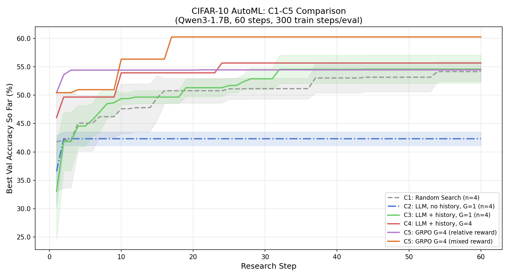

# Meeting Notes — AutoResearch-RL 项目汇报

> 日期：2026-05-24  
> 参与：教授 + 组员

---

## 一、项目背景与目标

**核心问题：** LLM 能否在没有人类干预的情况下，通过反复试验自动改进模型设计？

**做法：** 复现 AutoResearch-RL 思路，但把 action space 简化为**结构化 JSON 配置**（神经网络架构 + 训练超参），而不是让 LLM 写代码 diff。好处是：
- Reward 完全确定（跑一次 CIFAR-10 训练返回 val acc）
- 排除代码执行错误的干扰，专注于研究核心问题
- 便于受控消融实验

**模型：** Qwen3-1.7B（~3.4GB），本地运行，不依赖 API。

---

## 二、实验设计

设计了 5 个条件，每个步骤只改一个变量，形成消融链：

| 条件 | 描述 | 对比目标 |
|------|------|---------|
| C1 | 随机搜索（baseline） | — |
| C2 | LLM 无历史，G=1 | LLM prior 有没有用？ |
| C3 | LLM + 历史，G=1 | 历史上下文有没有用？ |
| C4 | LLM + 历史，G=4 | 多采样 best-of-G 有没有用？ |
| C5 | GRPO RL 更新，G=4 | 在线强化学习有没有进一步提升？ |

每一步评估：把 JSON config 编译成 PyTorch 模型，固定训练 300 步，返回 val acc 作为 reward。

---

## 三、目前结果

实验设置：Qwen3-1.7B，60 个 research steps，300 gradient steps/eval，A100。

| 条件 | Runs | 最终 best acc | ±std |
|------|------|--------------|------|
| C1 Random Search | 4 | 54.16% | ±1.72% |
| C2 LLM, no history | 4 | 42.32% | ±1.18% |
| C3 LLM + history | 4 | 54.59% | ±2.50% |
| C4 LLM + history, G=4 | 1 | 55.67% | — |
| C5 GRPO (relative reward) | 1 | 54.46% | — |
| C5 GRPO (mixed reward) | 1 | **60.26%** | — |

### 主要发现

**1. C2 比随机搜索还差（42% vs 54%）**

LLM 在没有任何历史反馈的情况下，会依赖预训练知识生成固定模式的配置，而这些配置在 CIFAR-10 上并不好。说明 LLM prior 本身对这个任务是有偏的，甚至是有害的。

**2. C3 ≈ C1（history 把 LLM 拉回随机水平）**

加了历史记录之后，LLM 能够根据过去实验结果调整方向，和随机搜索基本持平，但没有显著超越。在 G=1 的情况下，每步只能提一个候选，探索效率受限。

**3. C4 略好于 C3**

G=4 的 best-of-G 采样带来小幅提升，说明多样性采样有一定价值。

**4. Reward 设计对 C5 影响显著（约 6% 绝对差距）**

这是目前最有意思的发现。GRPO 在 `relative reward`（r = acc − best_so_far）下表现和随机搜索相当，但换成 `mixed reward`（r = 0.5·acc + 0.5·(acc − best_so_far)）后，最终 acc 从 54.46% 提升到 60.26%。

原因：relative reward 在 best_so_far 较高后，几乎所有候选的 reward 都是负数，且数值接近（方差小），GRPO 的 group-relative advantage 信号几乎为零，梯度消失。Mixed reward 保留了绝对精度项，防止这种退化。

---

## 四、待解决的问题 / 局限

1. **C4、C5 只跑了 1 次**，没有方差估计。C5 mixed 的 60.26% 是单次结果，需要多跑几次确认稳定性。

2. **C2 表现异常差** 值得进一步分析——是 Qwen3 在这类任务上特别依赖历史，还是 prompt 设计问题？

3. **训练步数较短（300 steps）**，存在评估噪声。不同 config 在 300 steps 时的相对排名和充分训练后可能不一样。

4. **C5 收敛曲线**：reward 长期为负，学习效率受限，mixed reward 改善了但 GRPO 是否真的在学习还需要进一步分析（比如 policy entropy、生成多样性的变化）。

---

## 五、后续工作

### 近期（优先级高）

- [ ] **C5 mixed reward 多 run**：跑 3-4 次，确认 60.26% 不是偶然
- [ ] **C4 多 run**：补全方差估计
- [ ] **reward_mode 对比实验**：systematic 地比较 relative / mixed / recent_mean 三种设计

### 中期

- [ ] **步数影响**：增加 n_steps（60 → 120）或 max_train_steps（300 → 1000），看曲线是否继续上涨
- [ ] **top config 稳定性验证**：C5 找到的 best config 在多个 seed 下重新训练，确认是否稳定
- [ ] **分析 C5 学到了什么**：比较 C5 前期 / 后期生成的 config 分布，是否有系统性偏移

### 更长期（如果结果 promising）

- [ ] 换更大模型（7B/14B），看 LLM capacity 的影响
- [ ] 扩展到更复杂任务（ImageNet-subset，或换成语言任务的超参搜索）
- [ ] 对比 Bayesian Optimization / Optuna 等传统 HPO 方法，量化 LLM-based 方法的优劣

---

## 六、可能被问到的问题

**Q: 为什么不用 CIFAR-10 上已有的 SOTA 方法做对比？**
A: 我们关注的不是绝对精度，而是不同搜索策略之间的相对提升幅度。300 steps 训练本身就不是为了找 SOTA，而是作为一个快速、确定性的评估信号。

**Q: C5 的 LoRA 训练对模型的影响有多大？**
A: LoRA r=16，只更新 q_proj 和 v_proj，参数量很小。目前没有分析 policy 的变化情况，这是一个值得看的方向。

**Q: 跟原版 AutoResearch-RL 的区别？**
A: 原版 LLM 写 Python 代码 diff 修改训练脚本，action space 无界，reward 非确定（代码可能有 bug）。我们限定为 JSON schema，牺牲了灵活性，换来了可控性和可复现性，适合研究搜索策略本身的贡献。

**Q: 60.26% 在 CIFAR-10 上是什么水平？**
A: 在 300 训练步这个极端 budget 下算不错，充分训练的 ResNet-18 可以到 93%+。这里比的是搜索效率，不是绝对 SOTA。
